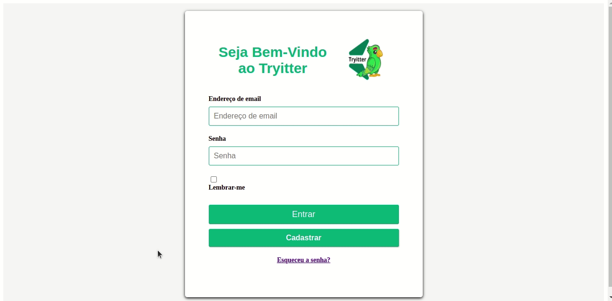
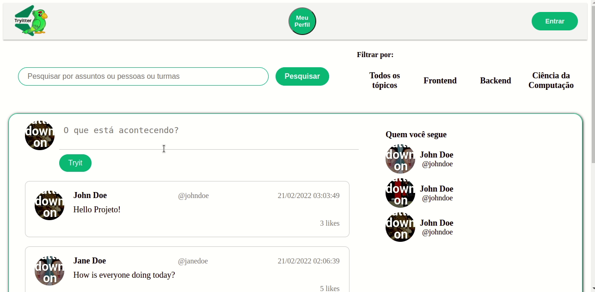
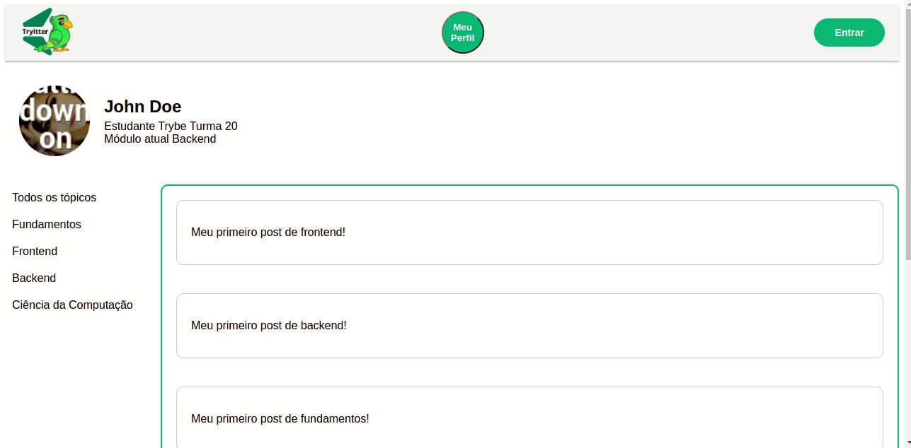

# Projeto-Tryitter
# Tryitter

Tryitter é uma rede social criada para proporcionar um ambiente em que as pessoas estudantes possam compartilhar suas experiências e acessar posts de diferentes módulos e turmas, que possam contribuir para seu aprendizado.

Este projeto foi desenvolvimento em Back-End utilizando C#, SQL Server e Azure e Front-End utilizando React.js

## Demostração

### Login Page

- Aqui o usuário fará o login inserindo seu email e senha.
- Caso não tenha cadastro, o usuário poderá se cadastrar clicando no botão de cadastro e inserindo suas informações:
  _name: nome da pessoa estudante;_
  _email: e-mail da pessoa estudante;_
  _modulo: módulo atual que estão estudando na Trybe;_
  _password: senha para se autenticar._
  _turma: informar a turma da pessoa estudante._

    

 

### Home page

- Depois de ter executado o login, o usuário terá acesso a está página.
- Aqui será possível ver os posts de todas as pessoas estudantes.
- Você poderá filtrar os posts por módulos, por exemplo, somente posts de backend...somente posts de frontend....
- Você poderá filtrar também por assuntos relevantes, trazendo os posts com mais curtidas ou por algumas palavras que você desejar.
- Você também poderá fazer um post com até 300 caracteres e opcional inserir uma imagem junto com o post.

    

 

### Profile page

- Clicando na sua foto no icone meu perfil, você será direcionado para a sua página de perfil.
- Aqui será possível ver todos os seus posts.
- Você poderá filtrar os seus posts por módulos, por exemplo, somente posts de backend...somente posts de frontend....
- Você também poderá excluir seus posts.
- Também será possível editar seu perfil, podendo editar algumas das suas informações como nome, email, turma...

    

 

## Funcionalidades

`Contas de pessoas estudantes`

- Para cadastrar uma conta de pessoa estudante na Tryitter, é necessário enviar uma requisição `POST` para a rota /api/students, utilizando o botão de **cadastrar** na página de login, com as seguintes informações:

_nome: nome da pessoa estudante;_
_email: e-mail da pessoa estudante;_
_modulo: módulo atual que estão estudando na Trybe;_
_password: senha para se autenticar._
_turma: informar a turma da pessoa estudante._

- Para alterar a conta de uma pessoa estudante, é necessário enviar uma requisição `PUT` para a rota /api/students/{id}, onde id é o ID da conta da pessoa estudante. Isso poderá ser realizado na página de perfil do estudante, onde será possível **editar** suas informações. Obs: É necessário estar autenticado para realizar essa operação.

- Para excluir uma conta de pessoa estudante, é necessário enviar uma requisição `DELETE` para a rota /api/students/{id}, onde id é o ID da conta da pessoa estudante. Isso poderá ser realizado na página de perfil do estudante, onde será possível **excluir** sua conta. Obs:É necessário estar autenticado para realizar essa operação.

## Posts

Para publicar um post na Tryitter, é necessário enviar uma requisição `POST` para a rota /api/posts com as seguintes informações:

_text: texto com até 300 caracteres;_
_image: arquivo de imagem (opcional)._

Para alterar um post já publicado, é necessário enviar uma requisição PUT para a rota /api/posts/{id}, onde id é o ID do post. No próprio post vocÊ poderá **editar** o post. Obs: É necessário estar autenticado e ser o autor do post para realizar essa operação.

Para excluir um post, é necessário enviar uma requisição DELETE para a rota /api/posts/{id}, onde id é o ID do post. No próprio post vocÊ poderá **excluir** o post. Obs: É necessário estar autenticado e ser o autor do post para realizar essa operação.

Para listar todos os seus posts, é necessário enviar uma requisição `GET` para a rota _/api/posts_.

Para listar o último post, é necessário enviar uma requisição `GET` para a rota _/api/posts/latest_.

Para listar todos os posts de uma conta x, é necessário enviar uma requisição `GET` para a rota _/api/posts/account/{id}_, onde id é o ID da conta da pessoa estudante.

Para listar o último post de uma conta x, é necessário enviar uma requisição `GET` para a rota _/api/posts/account/{id}/latest_, onde id é o ID da conta da pessoa estudante.

## Autenticação

Algumas rotas na Tryitter são autenticadas por motivos de segurança. Para se autenticar, é necessário enviar uma requisição POST para a rota /api/authenticate com as seguintes informações:

email: e-mail da pessoa estudante;
password: senha da pessoa estudante.
A resposta dessa requisição será um token JWT, que deve ser enviado no header das requisições autenticadas, com a seguinte chave-valor: Authorization: token.
